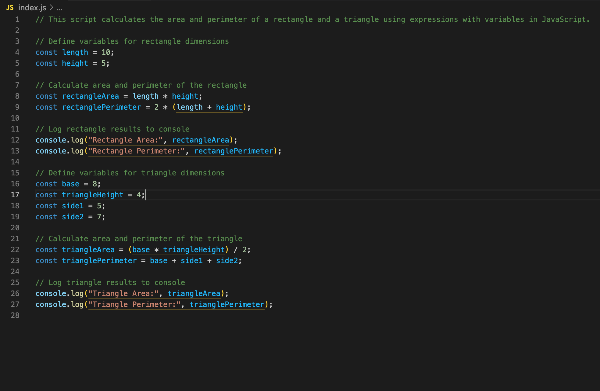

# Expression Exploration: Rectangle and Triangle Calculations


## Description 📄
In this assignment, you will work with JavaScript to calculate the area and perimeter of a rectangle and a triangle. You will define variables for the dimensions, use arithmetic operations to perform the calculations, and log the results to the console. This exercise will help you practice using variables and expressions to solve real-world mathematical problems in JavaScript.

## Expected Project Structure 🏗️

```plaintext
expression_exploration/
└── index.js
```

## Instructions ✅

### 1. **Create the Project Folder and Files**
   - [ ] Create a folder named `expression_exploration` to store all your project files.
   - [ ] Inside the `expression_exploration` folder, create a file named `index.js`. This will be your main JavaScript file.

   **Explanation:**
   - This step sets up the project structure, ensuring that all files are organized in a dedicated folder.

### 2. **Adding a Comment at the Top**
- [ ] Open your `index.js` file inside the `expression_exploration` folder and add the following comment.

```javascript
// This script calculates the area and perimeter of a rectangle and a triangle using expressions with variables in JavaScript.
```

   **Explanation:**
   - Adding a comment at the top helps document the purpose of the script, making the code easier to understand.

### 3. **Rectangle Calculations**
- [ ] Define the variables for the rectangle's `length` and `height`:

```javascript
// Define variables for rectangle dimensions
const length = 10;
const height = 5;
```

- [ ] Calculate the area and perimeter of the rectangle:

```javascript
// Calculate area and perimeter of the rectangle
const rectangleArea = length * height;
const rectanglePerimeter = 2 * (length + height);
```

- [ ] Log the calculated area and perimeter of the rectangle.

```javascript
// Log rectangle results to console
console.log("Rectangle Area:", rectangleArea);
console.log("Rectangle Perimeter:", rectanglePerimeter);
```

   **Explanation:**
   - In this step, you define the dimensions of the rectangle, calculate its area using `length * height`, and calculate the perimeter using `2 * (length + height)`. Finally, you log these results to the console for verification.

### 4. **Triangle Calculations**
- [ ] Define the variables for the triangle's `base`, `triangleHeight`, and the lengths of the other sides (`side1`, `side2`).

```javascript
// Define variables for triangle dimensions
const base = 8;
const triangleHeight = 4;
const side1 = 5;
const side2 = 7;
```

- [ ] Calculate the area and perimeter of the triangle.

```javascript
// Calculate area and perimeter of the triangle
const triangleArea = (base * triangleHeight) / 2;
const trianglePerimeter = base + side1 + side2;
```

- [ ] Log the calculated area and perimeter of the triangle.

```javascript
// Log triangle results to console
console.log("Triangle Area:", triangleArea);
console.log("Triangle Perimeter:", trianglePerimeter);
```

   **Explanation:**
   - This step involves defining the triangle's dimensions, calculating its area using `(base * height) / 2`, and its perimeter by summing all three sides. The results are logged to the console to verify the calculations.

### 5. **Run Your Code**
- [ ] Open your terminal and navigate to the folder containing your `index.js` file.
- [ ] Run the following command in the terminal.

```bash
node index.js
```

- [ ] Verify that your terminal displays the expected output.

```plaintext
Rectangle Area: 50
Rectangle Perimeter: 30
Triangle Area: 16
Triangle Perimeter: 20
```

   **Explanation:**
   - Running the script with Node.js executes the calculations, and the expected output confirms that the code is working correctly.

### 6. **Commit and Push to Github**
- [ ] Commit and push your work to Github.

   **Explanation:**
   - Committing and pushing your work saves your progress and makes it accessible for review and future reference.

## Conclusion 📄
In this exercise, you defined variables to represent the dimensions of a rectangle and a triangle, used arithmetic expressions to calculate their area and perimeter, and logged the results to the console. This practice reinforces how to use variables and expressions effectively in JavaScript to perform basic geometric calculations.

---

© All rights reserved to ThriveDX
